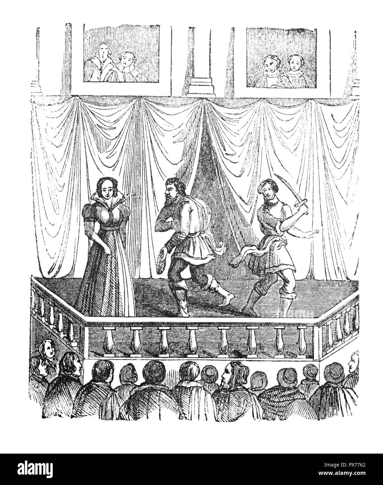

 ## Prologue- 

1. What is the place and setting of the play? 

The Prologue reveals the setting of the play. ( Fun fact the town is located between Milan and Venice Italy.) 

2. What is the relationship between the two households? 

In lines 26-27 of Act 1 Scene 1, Sampras's statement reveals the relationships between the two households. 

3. What does Shakespeare mean by “Star-crossed lovers”?

People who believe in Astrology believe that the stars control human destiny. Another word for Starcrossed is frustrated with the stars. 

4. What happens to the lovers? 

Line 8 of the Prologue reveals what happens. 

5. What is the subject matter of this play? 

Subject matter means what happens in the play. Base your response on what you learn in the prologue. 

6. What does the chorus ask of the audience in the last two lines? 

Toward the end of the prologue, the prologue asks the audience to do two things. (hint the prologue doesn’t directly mention the audience). 

7. What is the name of the poetic form Shakespeare uses for the Prologue? How many lines are there? 

The type of poetic form is one that uses a pattern of ABABABCDCD… 

8. List examples of poetic language.

In the Prologue, there four are used. When looking at the different poetic languages look for words that mean something different, rhymes, and patterns. 

9. Explain what you learn from the Prologue about the fate of Romeo and Juliet and the feud between the two families. 

Divide the prologue into two parts. Learning about Romeo and Juliet's fate: Lines 6-10. The two families feud: lines 1-5. 

10. What is the primary purpose of the Prologue to the play? 

If you like civics, ask yourself what is the purpose of the preamble of the constitution. Then apply it to this. If you are not a civics person, think of the prologue as a playbill. If you have ever been to a play, what does the playbill show you? 

## Act 1, Scene 1

1. The first scene of every Shakespeare tragedy was planned to get the attention of the groundlings, people of the lower classes who stood in the pit to watch the plays. Why might Scene 1 have appealed to the groundlings? 

This is a picture of groundlings (people standing below the stage). The groundlings had a front-row view. Ask yourself, what would you like to see close up, especially from the first scene? This can be opinionated but put yourself back in Shakespeare's day, and assume what the average person would like to see. 

2. Which words in the stage directions in line 44 clarify that Sampson is not speaking to Abram? 
Stage directions are often at the beginning or end of the poems.

3. With which family are the quarreling servants affiliated? 
You can use clues from how the characters act or what they say, or you can look at the cast. 

4. Tybalt’s name comes from the word that means “bold.” Benvolio is from Latin words that mean, “I wish” and “well.” From what you know about them so far, how appropriate are their names? 

The best example is when the two characters enter into a fight with the servants. Tybalt acts differently than Benvolio. Search in the play where the two characters enter the scene, and analyze how each reacts to the fight. 

Summarize the warning that the Prince issues to the Monatgues and Capulets in this speech. Why is he so upset. 

Lines 97 -119 reveals the Princes intentions. Observe the Princes tone, and expeirence with the two families. Still need help? Look for key words such as death and peace.

Who stops the brawl between the Monatgues and the Capulets. 

Look for stage cues, revealing the answer. 

What does this conversation reveal about Romeo's state of mind? 

Romeo uses a lot of euphemisms (Oxford Languages: a mild or indirect word or expression substituted for one considered to be too harsh or blunt when referring to something unpleasant or embarrassing). These euphemisms can reveal some of his state of mind. Still need help? look for key words such as I, or she to show his state of mind. 

What is an Oxymoron? 

Check Notes. 

What reason for his sadness does Benvolio give to Romeo about the woman he loves. 

Romeo mentions this many times. hint: In Elizabethan England being pure was very important. 

What advice does Benvolio give to Romeo about the woman he loves? 

You can connect Benvolio's advice to what his name means ("I wish" and "well") He is very relaxed, with simple solutions that aren't thought of quickly. Romeo has a negative reaction to Benvolio's statement. 

## Act 1, Scene 2

Why does Capulet's servant talk to Romeo and Benvolio. 

Put yourself in the Elizabethean era. Many servants were less fortunate people. We can re-write this question to: Why would a servant ask for help? Hint: In shaekspears age only the wealthy were educated. 

Chance plays an important part in the events of the play. How do you think this chance meeting (between Capulet's Servant and Romeo) will advance the plot. 

What we know from the text is that Romeo and Benvolio have been invited to a dinner. We also know from Scene 1 that Romeo is heart broken. Now, apply this to the question. Hint: what families are the characters in the scene from? 

What important information in the stage directions clarifies Romeo's speech here (lines 63-67) 

Look in Romeo's speech when reading the note. Hint: Stage directions are usually in the beginning or end of the speech and in parenthesis. 

## Act 1, Scene 3 

How old is Juliet

Look in Capulet's speech. He mentions that she is not ready to be married. Hint: Most girls and boys were married young for either political or financial reasons. 

What do the Nurse's words reveal about her devotion to Juliet. 

Look in lines (387 -409). The Nurses speech reveals that she has a long history with Juliet. The Nurse probabaly took care of her since birth. 

